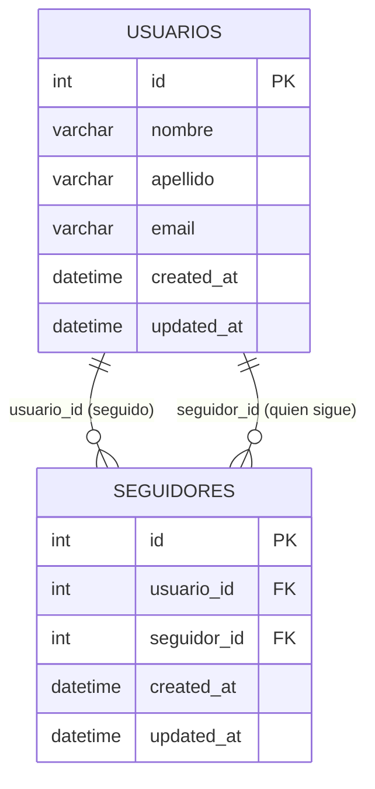

# Recursos del esquema

El diagrama lógico de la actividad es una auto-relación N:N: ambos roles de la tabla `seguidores` apuntan a `usuarios.id`.

El archivo fuente SQL es [../flask_app/bd/esquema_seguidores.sql](../flask_app/bd/esquema_seguidores.sql). La entrega solicitada también incluye `esquema_seguidores_erd.mwb`; ese archivo nativo no se generó aquí porque MySQL Workbench no está disponible en las ubicaciones habituales del entorno. Para generarlo, importa el SQL en Workbench y guarda el modelo EER en esta carpeta con ese nombre.

La captura de la aplicación funcionando también queda pendiente: el servicio MySQL local está activo, pero rechazó la autenticación `root` sin contraseña. Configura las variables `MYSQL_*`, ejecuta el SQL y después inicia Flask para obtener evidencia real con relaciones almacenadas.
